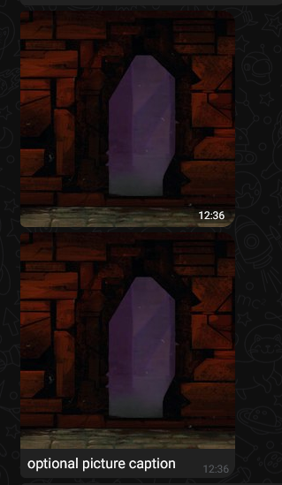
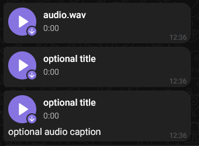

# La Bibliotca de Epicron

[@EpicronBot](t.me/EpicronBot) es un bot de Telegram que cuenta historias. Su biblioteca está abierta a colaboraciones. Soporta historias escritas en el lenguaje [YarnSpinner](https://yarnspinner.dev/).

## Contribuyendo
Para contribuir con historias, simplemente envíen un PR respetando la estructura de las otras historias.
La historia `the-spire` existe a modo de ejemplo. Las reglas que hay que seguir son las siguientes:
- Dentro de `/stories` hacer una carpeta nueva para tu historia, sin espacios. Por ejemplo `the-spire`.
- Dentro de esa carpeta, agregar el archivo `metadata.csv` con los datos requeridos (ver ejemplo):
    - Nombre
    - Sinopsis
    - Autor
    - Idioma
- Dentro de esa carpeta, hacer otra llamada `compiled` con los archivos de historia de yarn spinner compilados. Es importante que tengan estos nombres:
    - `story.yarnc`
    - `story-Lines.csv`
    - `story-Metadata.csv`
- Se puede incluir los archivos fuente del proyecto en una carpeta `source`. No es necesario para que el bot pueda contar una historia, pero se alienta, por su valor educativo.

La propiedad intelectual de las historias corresponde siempre a sus autores. Epicron atribuye los créditos siempre a quien corresponde, según lo que hay en el archivo `metadata.csv`. 

## Compilar una historia de YarnSpinner
Para compilar una historia de YarnSpinner, se debe usar la utilidad `YarnSpinner-Console` disponible [aqui](https://github.com/YarnSpinnerTool/YarnSpinner-Console).

Los proyectos de YarnSpinner pueden tener varios archivos. Si se desea compilar todos los archivos en un directorio, dado que estén todos los archivos en el mismo lugar, se puede correr este pequeño script de bash:

```bash
mkdir compiled
ysc compile --output-directory ./compiled/ --output-name story $(ls | grep ".yarn")
```

Esto generará una nueva carpeta llamada `compiled` con todo lo necesario para subir la historia, tal cual está, a este repositorio.

## Comandos Soportados
YarnSpinner soporta [comandos](https://docs.yarnspinner.dev/getting-started/writing-in-yarn/commands) y [funciones](https://docs.yarnspinner.dev/getting-started/writing-in-yarn/functions). La diferencia entre funciones y comandos es principalmente ésta: Llamamos a las funciones cuando necesitamos obtener información (por ejemplo, cual es el resultado de tirar un dado?), y llamamos a los comandos cuando queremos que algo suceda (por ejemplo, esperar cierta cantidad de segundos antes de continuar).

Epicron soporta todas las funciones y comandos built-in, con la salvedad de `stop`. Llamar a este comando provoca el final de la historia, no solo el final del dialogo

Estas funciones personalizadas están disponibles:
- get_player_name
- get_player_nickname
- get_player_premium_status

Estos comandos personalizados están disponibles:
- send_picture: enviar una imagen al chat. Es una ruta desde `/stories/story-name/pictures/`
```
<<send_picture pic.png>>
<<send_picture pic.png "optional picture caption">>
```
.
- send_audio: enviar un audio al chat. Es una ruta desde `/stories/story-name/audios/`
```
<<send_audio audio.wav>>
<<send_audio audio.wav "optional title">>
<<send_audio audio.wav "optional title" "optional audio caption">>
```
.
- return: volver al nodo anterior, justo en la linea siguiente al `<<jump NodeName>>`.

Si necesitas más comandos o funciones, abre un Issue y charlamos. Si es algo de lo que otras historias se pueden beneficiar, seguro lo agrego.

## Roll automático de opciones
Presentar 6 [opciones](https://docs.yarnspinner.dev/getting-started/writing-in-yarn/lines-nodes-and-options#options) o más, generará un roll automático. Esto está pensando para agregar un poco de proceduralidad a las historias. Podría ser optativo, configurado en el la metadata de la historia.